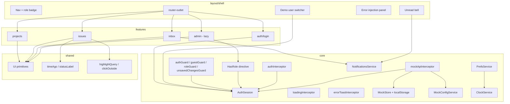
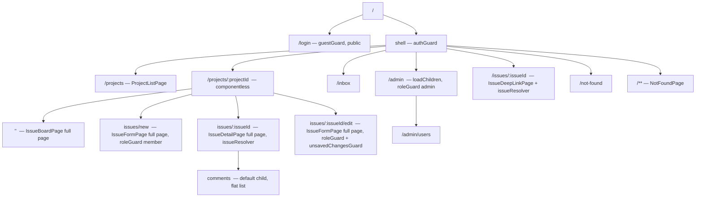

# IssueForge — Modern Angular Interview Portfolio

| Field | Value |
| --- | --- |
| **Title** | IssueForge: Angular Issue Tracker (Interview Portfolio) |
| **Author** | Grok (design-doc-writer) |
| **Date** | 2026-09-17 |
| **Status** | Approved |
| **Workspace** | `/Users/mauricio/Documents/github/projects/angular-tutorial` (empty greenfield git repo, no commits; folder name is historical) |
| **Repo / package name** | `issueforge` (`package.json` `name`, README title, `ng new` project name) |
| **Target stack** | Angular 22.x (latest stable as of 2026-09), standalone, zoneless, Vitest |

---

## Overview

IssueForge is a Jira-lite issue tracker built as **one coherent product**, not a bag of isolated demos. A candidate can walk an interviewer through login, a project board, issue CRUD, comments as a nested **route** (flat list, no threads), search, notifications, and an admin users page — and every screen is a live example of a modern Angular API (signals, `@if`/`@for`, `httpResource`, functional guards, interceptors, RxJS).

There is **no real backend**. The app talks to itself through `HttpClient` / `httpResource` against `/api/**`. A functional HTTP interceptor owns an in-memory store (persisted to `localStorage`), simulates latency, enforces a fake JWT, and can inject 401/403/500/timeout on demand. Auth is mocked end-to-end: three seeded roles (viewer / member / admin), an auth interceptor, route guards, a `HasRole` directive, and a demo user switcher so interviewers can flip roles without retyping credentials.

Implementation is sequenced as **19 v1 commits**, then **PR 20** (Signal Forms login) and **PR 21** (CDK drag-and-drop). Each commit leaves the app compiling. After **PR 7** the app is runnable with a real login screen and an authenticated “You’re in” stub; after **PR 9** that stub is the project list. Do not pull `@angular/cdk` into commits 1–19.

---

## Background & Motivation

The workspace is an empty git repo. The goal is interview-prep that still looks like a real product: extra Angular topics must land as routes, directives, or small UI pieces, not rewrites.

Pain points this design removes:

- **Toy-app smell.** Isolated “signals demo” / “guards demo” pages do not survive a portfolio review. IssueForge’s features are the product.
- **Fake data access.** Hand-wavy in-component arrays skip interceptors, `httpResource`, error states, and 401 handling — the exact things interviews probe.
- **Zone.js-era patterns.** `NgModule`, `*ngIf`/`*ngFor`, constructor injection, and class-based interceptors are legacy. New Angular 22 apps are standalone, zoneless, and signal-first by default.
- **Giant first PR.** Scaffolding plus the whole app in one dump is unreviewable and hides the learning path. Commits are the rollout.

Current state of the repo: **no source files**. Every path below is proposed, not existing.

---

## Goals & Non-Goals

### Goals

- Ship a usable v1: login, project list, kanban board, issue detail, create/edit, comments as a nested route, search, inbox, admin users.
- Use **latest Angular 22** CLI defaults: standalone, zoneless (no `zone.js`), OnPush-by-default, Vitest.
- Exercise the interview surface listed in [Interview-feature mapping](#interview-feature-mapping).
- Mock HTTP and auth so the app uses the real `HttpClient` stack (`httpResource`, interceptors, guards).
- Keep commits small, independently reviewable, and in a compileable (then runnable) state.
- Leave extension points (new routes, directives, pipes) so later interview topics do not require a rewrite.

### Non-Goals

- Real backend, database, or auth provider (Auth0, Firebase, cookies).
- SSR / hydration / PWA / service worker.
- Angular Material or Tailwind. Styling is a small CSS-variable design system. `@angular/cdk/drag-drop` is **PR 21 only**, after v1.
- NgRx / signal-store / global event bus. Feature services + signals are enough at this scale (32 issues).
- Full i18n, theming marketplace, file attachments, or real-time websockets.
- Production deployment, CI/CD to hosting, or analytics.
- Pixel-perfect Jira clone (no sprints, no burndown, no permissions matrix beyond three roles).
- Threaded / nested-reply comments. Comments are a **flat list** on a nested **route**.

---

## Key Decisions

| Decision | Choice | Rationale |
| --- | --- | --- |
| Product name | **IssueForge** | Distinctive, professional, not a Trello clone. Selector prefix: `forge`. Seeded emails stay `*@board.dev` as already specified in conversation. |
| Repo / package name | **`issueforge`** | `package.json` `"name": "issueforge"`, README title, `ng new issueforge`. Workspace folder may still be `angular-tutorial` until renamed on disk; do not keep `angular-tutorial` as the npm/GitHub name. |
| Angular version | **Angular 22.x** via `npx @angular/cli@22 new` | Current stable (22.1.x as of 2026-09). `httpResource` / `resource` / Signal Forms are stable. Zoneless is the default since v21; OnPush is the default since v22. |
| Change detection | **Zoneless, no `zone.js`** | CLI default. Do **not** add `provideZonelessChangeDetection()` unless the generated `app.config.ts` already has it; do **not** add `provideZoneChangeDetection()`. Verify `zone.js` is absent from `package.json` and `angular.json` polyfills. Pin `--zoneless=true` on `ng new` so a CLI drift cannot silently reintroduce Zone. |
| Modules | **No NgModules** | Standalone components, `bootstrapApplication`, `provideRouter`, `provideHttpClient`. |
| Templates | **New control flow, plus one structural-directive exception** | `@if` / `@else if` / `@else`, `@for` (always with `track`), `@empty`, `@switch`, `@defer`, `@let`. Ban `*ngIf`, `*ngFor`, `*ngSwitch`. The **only** `*` microsyntax in the repo is `*hasRole`. Production chrome should prefer `@if (session.hasRole('member'))`; the directive exists to teach `TemplateRef` / `ViewContainerRef` / an internal `effect()`. |
| State | **Signals first** | `signal()`, `computed()`, `linkedSignal()` for state that must reset when a source changes. `effect()` is allowed only for (1) `PrefsService` persistence to `localStorage`, (2) directives that project or rewrite DOM from signals (`HasRole`, `HighlightQuery`). No effects for fetching or navigation. |
| Reads vs writes | **`httpResource` for GET; `HttpClient` + RxJS for mutations** | Official guidance: `httpResource` is eager, reactive, interceptor-aware, and must not be used for POST/PUT/PATCH/DELETE. After a write, call `resource.reload()` (or bump a `refreshTick` signal). |
| DI | **`inject()` everywhere** | No constructor injection in app code. `inject()` is legal in field initializers, `ResolveFn` / `CanActivateFn` bodies, and interceptor **function bodies** — **not** inside RxJS callbacks (`map`, `catchError`, `tap`). Capture dependencies at the top of the function, then close over them. |
| Routing | **Feature folders + lazy `loadComponent` / `loadChildren`** | Admin is lazy. Other features are lazy too so the pattern is visible, not a one-off. Full route arrays are in [Route tree](#route-tree). |
| Forms | **Reactive Forms for v1 issue create/edit; Signal Forms for login in PR 20** | Interviewers still ask about dirty/touched/validators/`valueChanges`. Zoneless requires bridging form observables with `toSignal()` — that *is* the teaching moment. PR 20 converts **login only** to stable Signal Forms so both APIs exist in the repo. Issue form stays Reactive Forms. |
| UI kit | **No Material, no Tailwind** | Interviews grade Angular, not Material theming. CSS custom properties + primitives (button, badge, input, dialog, toast, spinner, avatar, empty-state, card). |
| Styling | **Global CSS + CSS variables**, not SCSS | One `styles.css`, `styles/tokens.css`, per-component CSS. |
| Templates on disk | **Pages: `*.page.ts` + `*.page.html` + `*.page.css`. Primitives: inline template under ~20 lines** | Stops PRs mixing `template:` and `templateUrl` at random. |
| Backend mock | **Functional `HttpInterceptorFn` that terminates `/api/**`** | App code is identical to a real API. See [Backend mocks](#backend-mocks). |
| Persistence | **`localStorage` for DB *and* auth session** | Explicit requirement: refresh keeps data and session. Key prefix `issueforge.`. Passwords are **not** serialized; they live in `mock.seed.ts` module scope. |
| Token format | **Unsigned fake JWT** (3 base64url segments) | Interviewers can decode the payload in DevTools. Mock backend checks `exp` and `sub`, not a signature. |
| Test runner | **Vitest** (CLI default since v21) | Do not add Karma. Specs for guards, resolvers, pipes, mock router, auth session, and store mutations (there are **no** reducers). Specs land in the same PR as the artifact. Light component tests only where they earn their keep. |
| File names | **CLI keeps 2025 names; subsequent files use type suffixes** | `ng new` (2025 style guide) emits `app.ts`. Do not rename CLI files. All files **we** add use type suffixes (`*.component.ts`, `*.guard.ts`, `*.interceptor.ts`, `*.page.ts`) for interview grep-ability. Never call `ng generate` without noting that mismatch. Class names match files: `LoginPage`, `IssueBoardPage`, `IssueCard` (presentational, no `Component` suffix). |
| State library | **None** | 32 issues, 4 projects, 5 users. A `MockStore` plus per-feature services is the right size. |
| SSR | **Off** (`--ssr=false`) | `localStorage` mock backend and interview demos do not benefit from SSR. |
| Demo user switcher | **Always visible in the shell** (not `isDevMode`-gated) | This *is* how we exercise auth in interviews. Label it “Demo” in the UI. |
| Latency | **250–400ms random, `MockConfig.latencyMs` default `300`** | One number everywhere. Slider 0–5000. |
| Notifications | **`NotificationsService` lives in `core/`** | Shell unread-bell and inbox page both consume core. Features never import other features. |

---

## Proposed Design

### Product surface (v1)

**IssueForge** is a small-team tracker.

| Flow | Route | Who |
| --- | --- | --- |
| Login / logout | `/login` | public (`guestGuard`) |
| Project list | `/projects` | any authenticated |
| Project board (columns by status) | `/projects/:projectId` | any authenticated |
| Issue detail (full page, replaces board) | `/projects/:projectId/issues/:issueId` | any authenticated |
| Comments (nested **route**, flat list, no threads) | `.../issues/:issueId/comments` (default child of detail) | GET: any authenticated; POST: member+ |
| Create issue (full-page form, sibling of board) | `/projects/:projectId/issues/new` | member, admin |
| Edit issue (full-page form, sibling of board **and** detail — not inside detail chrome) | `/projects/:projectId/issues/:issueId/edit` | member, admin |
| Notification inbox | `/inbox` | any authenticated |
| Admin users | `/admin/users` (lazy) | admin |
| Deep link from inbox | `/issues/:issueId` → redirect into project URL | any authenticated |
| Explicit 404 | `/not-found` (also `**`) | any authenticated |

Core issue fields: `title`, `description`, `status`, `priority`, `assigneeId`, `labelIds`, `projectId`, timestamps, `reporterId`.

**UX, not left to guesswork:**

- The board is **replaced** by detail (full page). `IssueBoardPage` has **no** child `router-outlet`. This is not a master-detail split.
- `:projectId` is a **componentless** parent. Board, create, detail, and edit are sibling full-page children.
- `IssueDetailPage` **does** wrap a child `router-outlet`. Its chrome (title, meta, tab strip) stays visible. The default child is `comments`.
- `new` and `edit` are **not** children of detail, so the form is not squeezed into the detail tab chrome.

### Folder structure

Proposed layout after the full commit series. Nothing in this tree exists yet.

```
src/
  index.html
  main.ts
  styles.css
  styles/
    tokens.css
    reset.css
  app/
    app.config.ts
    app.routes.ts
    app.ts                          # root: router-outlet only (CLI 2025 name, keep)
    core/
      models/
        user.model.ts
        project.model.ts
        issue.model.ts
        comment.model.ts
        notification.model.ts
        auth.model.ts
        api.model.ts                # ListResponse, CreateIssueRequest, ApiErrorBody, AdminUser
      auth/
        auth.session.ts             # signal session, login/logout/me/clear/impersonate
        auth.guard.ts
        guest.guard.ts
        role.guard.ts
        unsaved-changes.guard.ts
        auth.interceptor.ts
        has-role.directive.ts
      notifications/
        notifications.service.ts    # RxJS poll/stream; unreadCount computed — consumed by shell + inbox
      prefs/
        prefs.service.ts            # theme + boardFilters; the persist effect() lives here
      clock/
        clock.service.ts            # now signal, ticks every 30s, second arg to timeAgo
      mock-backend/
        mock.store.ts               # in-memory state + localStorage
        mock.seed.ts                # deterministic seed + SEED_PASSWORDS (not persisted)
        mock.router.ts              # method+path → handler
        mock-api.interceptor.ts
        mock.config.ts              # latency / error injection knobs
      http/
        loading.service.ts          # inFlight signal
        loading.interceptor.ts
        error-toast.interceptor.ts
        api.tokens.ts               # SKIP_ERROR_TOAST only
    shared/
      pipes/
        time-ago.pipe.ts
        status-label.pipe.ts
      directives/
        highlight-query.directive.ts
        click-outside.directive.ts
      ui/
        button.component.ts
        badge.component.ts
        avatar.component.ts
        spinner.component.ts
        toast.component.ts
        toast.service.ts
        empty-state.component.ts
        confirm-dialog.component.ts
        text-field.component.ts
    layout/
      shell.component.ts            # nav, role badge, user switcher, unread bell, outlet
      stub-home.page.ts             # PR 2–8 “You’re in”; removed in PR 9
      stub-home.page.html
      not-found.page.ts
      not-found.page.html
      demo-user-switcher.component.ts
      error-injection-panel.component.ts
    features/
      auth/
        login.page.ts
        login.page.html
        login.page.css
      projects/
        projects.routes.ts
        project-list.page.ts
        project-list.page.html
        project-list.page.css
        project-card.component.ts
      issues/
        issues.routes.ts
        issue.service.ts            # mutations via HttpClient
        issue-board.page.ts
        issue-board.page.html
        issue-board.page.css
        issue-column.component.ts
        issue-card.component.ts
        issue-filters.component.ts
        issue-detail.page.ts
        issue-detail.page.html
        issue-detail.page.css
        issue-detail.resolver.ts
        issue-deep-link.page.ts
        issue-comments.page.ts
        issue-comments.page.html
        issue-comments.page.css
        issue-form.page.ts
        issue-form.page.html
        issue-form.page.css
        issue-search.component.ts   # RxJS debounce
      inbox/
        inbox.routes.ts
        inbox.page.ts
        inbox.page.html
        inbox.page.css
      admin/
        admin.routes.ts
        users.page.ts
        users.page.html
        users.page.css
```

Rules:

- `core/` is singleton infrastructure (`providedIn: 'root'`). Feature folders do not import other features; they import `core/` + `shared/`. Layout imports only `core/` + `shared/` (the unread bell reads `NotificationsService` from `core/notifications/`).
- Route-level pages are smart (resources, services) and use external `.html` / `.css`. Cards/columns/filters/primitives are presentational (`input()` / `output()` / `model()`) with **inline** templates under ~20 lines.
- No `shared.module.ts`. Shared pieces are standalone and imported per component `imports: []`.
- `HasRole` lives in `core/auth/` (needs `AuthSession`). It is **not** a `shared/` directive.

### Architecture boundaries



### HTTP interceptor chain (order is a load-bearing decision)

`provideHttpClient(withInterceptors([...]))` runs interceptors **in array order on the request**, reverse on the response. The mock interceptor **must be last** so it sees the `Authorization` header and can synthesize a response without calling `next()` (no network).

This four-interceptor array is installed in **PR 6** (auth + loading + mock) and **PR 7** inserts `errorToastInterceptor` in slot 3. From PR 7 onward the order is frozen:

```ts
provideHttpClient(
  withInterceptors([
    authInterceptor,          // 1. attach Bearer token (skip only POST /api/auth/login by URL)
    loadingInterceptor,       // 2. begin(); next().pipe(finalize(() => end()))
    errorToastInterceptor,    // 3. tap HttpErrorResponse → ToastService; 401 → session.clear()
    mockApiInterceptor,       // 4. LAST: /api/** → in-memory store; never next()
  ]),
)
```

`loadingInterceptor` **must** use `finalize`, because the mock returns a synthetic `HttpResponse` *or* `HttpErrorResponse` and never hits the network. Both success and error must decrement `inFlight`:

```ts
export const loadingInterceptor: HttpInterceptorFn = (req, next) => {
  const loading = inject(LoadingService);
  loading.begin();
  return next(req).pipe(finalize(() => loading.end()));
};
```

`errorToastInterceptor` injects `ToastService`, `AuthSession`, and `Router` **at the top of the function** (not inside `tap`). On `HttpErrorResponse`:

- Always `finalize` already ran in loading (outer wrap).
- If `!req.context.get(SKIP_ERROR_TOAST)`, show a toast.
- If `status === 401` **and** the URL is not `POST /api/auth/login`, call `session.clear()` and `router.navigateByUrl('/login')`.

Login skip is a **URL compare** (`req.method === 'POST' && req.url.startsWith('/api/auth/login')`). There is no `SKIP_AUTH` token. The only `HttpContextToken` is `SKIP_ERROR_TOAST`.

Because loading and toast wrap `next()`, **every** mock outcome (200, 401, 403, 422, 500, timeout) flows back through toast then loading then the caller. The sequence diagram matches that:

```mermaid
sequenceDiagram
  participant C as Component / httpResource
  participant HC as HttpClient
  participant A as authInterceptor
  participant L as loadingInterceptor
  participant T as errorToastInterceptor
  participant M as mockApiInterceptor
  participant S as MockStore (localStorage)
  participant N as Real network

  C->>HC: GET /api/issues?projectId=prj_if
  HC->>A: req
  A->>A: clone + Authorization Bearer jwt
  A->>L: req'
  L->>L: inFlight++
  L->>T: req'
  T->>M: req'
  alt url starts with /api/
    M->>M: latency 250–400ms default 300 (MockConfig)
    alt injected failure or timeout
      M-->>T: HttpErrorResponse 401/403/500/0
      T->>T: toast; 401 → session.clear() + /login
      T-->>L: error
      L->>L: finalize inFlight--
      L-->>C: error signal / Observable error
    else auth missing/invalid except login
      M-->>T: HttpErrorResponse 401
      T->>T: toast + session.clear()
      T-->>L: error
      L->>L: finalize inFlight--
      L-->>C: error
    else role cannot write
      M-->>T: HttpErrorResponse 403
      T->>T: toast
      T-->>L: error
      L->>L: finalize inFlight--
      L-->>C: error
    else match route
      M->>S: read/write entities
      S-->>M: body
      M-->>T: HttpResponse 200/201/204
      T-->>L: response
      L->>L: finalize inFlight--
      L-->>C: body / value signal
    end
  else non-API assets
    M->>N: next(req)
    N-->>T: real response
    T-->>L: response
    L->>L: finalize inFlight--
    L-->>C: body
  end
```

Non-`/api/` requests (CSS, assets) pass through to the browser. There is no other backend.

### Route tree



#### `app.routes.ts` (complete)

```ts
export const appRoutes: Routes = [
  {
    path: 'login',
    canActivate: [guestGuard],
    loadComponent: () =>
      import('./features/auth/login.page').then((m) => m.LoginPage),
  },
  {
    path: '',
    canActivate: [authGuard],
    loadComponent: () =>
      import('./layout/shell.component').then((m) => m.Shell),
    children: [
      { path: '', pathMatch: 'full', redirectTo: 'projects' },
      {
        path: 'projects',
        loadChildren: () =>
          import('./features/projects/projects.routes').then((m) => m.PROJECTS_ROUTES),
      },
      {
        path: 'inbox',
        loadChildren: () =>
          import('./features/inbox/inbox.routes').then((m) => m.INBOX_ROUTES),
      },
      {
        path: 'admin',
        canActivate: [roleGuard('admin')],
        loadChildren: () =>
          import('./features/admin/admin.routes').then((m) => m.ADMIN_ROUTES),
      },
      {
        path: 'issues/:issueId',
        resolve: { issue: issueResolver },
        loadComponent: () =>
          import('./features/issues/issue-deep-link.page').then((m) => m.IssueDeepLinkPage),
      },
      {
        path: 'not-found',
        loadComponent: () =>
          import('./layout/not-found.page').then((m) => m.NotFoundPage),
      },
      {
        path: '**',
        loadComponent: () =>
          import('./layout/not-found.page').then((m) => m.NotFoundPage),
      },
    ],
  },
];
```

Until PR 9, the authenticated default child is `StubHome` (`path: ''` → stub, no `redirectTo: 'projects'`). Login, `guestGuard`, and `roleGuard` all target `'/'` so they work before `/projects` exists. PR 9 replaces the stub with the redirect above — the **only** commit that names `/projects` as the home.

#### `projects.routes.ts` (complete)

```ts
export const PROJECTS_ROUTES: Routes = [
  {
    path: '',
    loadComponent: () =>
      import('./project-list.page').then((m) => m.ProjectListPage),
  },
  {
    path: ':projectId',
    // componentless: no component, no board outlet
    loadChildren: () =>
      import('../issues/issues.routes').then((m) => m.ISSUES_ROUTES),
  },
];
```

#### `issues.routes.ts` (complete)

```ts
export const ISSUES_ROUTES: Routes = [
  {
    path: '',
    loadComponent: () =>
      import('./issue-board.page').then((m) => m.IssueBoardPage),
  },
  {
    path: 'issues/new',
    canActivate: [roleGuard('member')],
    loadComponent: () =>
      import('./issue-form.page').then((m) => m.IssueFormPage),
  },
  {
    path: 'issues/:issueId',
    resolve: { issue: issueResolver },
    loadComponent: () =>
      import('./issue-detail.page').then((m) => m.IssueDetailPage),
    children: [
      { path: '', pathMatch: 'full', redirectTo: 'comments' },
      {
        path: 'comments',
        loadComponent: () =>
          import('./issue-comments.page').then((m) => m.IssueCommentsPage),
      },
    ],
  },
  {
    path: 'issues/:issueId/edit',
    canActivate: [roleGuard('member')],
    canDeactivate: [unsavedChangesGuard],
    loadComponent: () =>
      import('./issue-form.page').then((m) => m.IssueFormPage),
  },
];
```

`edit` is a **sibling** of `issues/:issueId`, not a child of it. Navigating to edit tears down `IssueDetailPage` and mounts `IssueFormPage` full-page.

#### `inbox.routes.ts` / `admin.routes.ts` (complete)

```ts
export const INBOX_ROUTES: Routes = [
  {
    path: '',
    loadComponent: () => import('./inbox.page').then((m) => m.InboxPage),
  },
];

export const ADMIN_ROUTES: Routes = [
  { path: '', pathMatch: 'full', redirectTo: 'users' },
  {
    path: 'users',
    loadComponent: () => import('./users.page').then((m) => m.UsersPage),
  },
];
```

### Scaffold command

Repo is already a git working tree (`.git` present, possibly `.DS_Store`). `ng new --directory .` will refuse a non-empty directory unless forced. Pin **every** flag:

```bash
npx @angular/cli@22 new issueforge \
  --directory . \
  --force \
  --routing \
  --style=css \
  --ssr=false \
  --skip-git \
  --defaults \
  --prefix=forge \
  --zoneless=true
```

`--skip-git` because the repo already exists; we do not want a nested repo or a CLI initial commit colliding with the planned commit series. `--force` overwrites nothing useful in an empty working tree besides allowing `.git`. `--prefix=forge` so we do not hand-edit `angular.json`. `--zoneless=true` pins the v21+ default. The CLI project name `issueforge` becomes `package.json` `"name"` — do not leave it as `angular-tutorial`.

After generation, commit 1 is our explicit `chore: scaffold IssueForge` commit.

Post-scaffold checklist (commit 1):

- Confirm Angular `^22.` in `package.json`.
- Confirm **no** `zone.js` dependency and no `zone.js` in `angular.json` polyfills.
- Confirm Vitest, not Karma.
- Confirm `"prefix": "forge"`.
- Leave CLI file names (`app.ts`) alone. Subsequent files we add use type suffixes; do not run `ng generate` later without documenting the 2025-vs-suffix split.
- `provideHttpClient` is **not** added until PR 4. Commit 1 is CLI output + title polish (`IssueForge` in `index.html`).
- Delete placeholder CLI hero content down to a single `router-outlet`.

### Design tokens and shell

`styles/tokens.css` — a small, interview-visible design system:

```css
:root {
  color-scheme: light dark;
  --font-sans: system-ui, "Segoe UI", Roboto, sans-serif;
  --font-mono: ui-monospace, "SF Mono", Menlo, monospace;

  --bg: #0f1419;
  --bg-elev: #1a222c;
  --bg-hover: #243040;
  --border: #2e3a48;
  --text: #e7ecf1;
  --text-muted: #8b9aab;
  --accent: #6ea8fe;
  --accent-ink: #0b1220;
  --danger: #f87171;
  --ok: #34d399;
  --warn: #fbbf24;

  --status-todo: #64748b;
  --status-in-progress: #6ea8fe;
  --status-in-review: #c084fc;
  --status-done: #34d399;

  --priority-low: #64748b;
  --priority-medium: #fbbf24;
  --priority-high: #fb923c;
  --priority-critical: #f87171;

  --radius: 10px;
  --shadow: 0 8px 24px rgb(0 0 0 / 0.35);
  --space-1: 4px;
  --space-2: 8px;
  --space-3: 12px;
  --space-4: 16px;
  --space-6: 24px;
  --space-8: 32px;
}
```

Default theme is **dark** (portfolio screenshots, projector-friendly). A `data-theme="light"` override on `<html>` is toggled by `PrefsService.theme`.

**`PrefsService`** (`core/prefs/prefs.service.ts`) is the persistence owner — not `ThemeService`, and not the board page writing `localStorage` itself:

```ts
export const EMPTY_BOARD_FILTERS: BoardFilterSlice = {
  query: '',
  status: null,
  assigneeId: null,
};

@Injectable({ providedIn: 'root' })
export class PrefsService {
  readonly theme = signal<'dark' | 'light'>(readTheme());
  /** Per-project slices. A missing key means the user has never filtered that project. */
  readonly boardFilters = signal<Record<string, BoardFilterSlice>>(readBoardFilters());

  patchBoardFilters(projectId: string, slice: BoardFilterSlice): void {
    this.boardFilters.update((all) => ({ ...all, [projectId]: slice }));
  }

  private readonly persist = effect(() => {
    const payload = {
      theme: this.theme(),
      boardFilters: this.boardFilters(),
    };
    localStorage.setItem('issueforge.prefs', JSON.stringify(payload));
  });
}
```

That is the **application-level** `effect()`. Directives may have their own (see [effect policy](#effect-policy)). The board page never opens `localStorage`; it calls `prefs.patchBoardFilters` after user edits. **Do not** persist a single global `{ query, status, assigneeId }` — that would re-apply chips the `linkedSignal` just cleared when switching projects.

Shell layout: top bar (logo, nav, inbox bell with unread count from `NotificationsService.unreadCount`, user menu, demo switcher) + main `router-outlet`. No sidebar in v1.

PR 2 wires this for real: `app.routes.ts` loads `Shell` at `''` with `StubHome` as the only child, so “header renders” is a click-path, not a dangling component.

### Effect policy

`effect()` is easy to abuse (fetching, navigating, keeping two stores in sync). Allowed uses:

1. **`PrefsService` persist** — write `issueforge.prefs` when `theme` or `boardFilters` change.
2. **Directives that project or rewrite DOM from signals** — `HasRole` creates/clears an embedded view; `HighlightQuery` rewrites host text when the query `input()` changes. Each documents the `effect()` in a 3-line comment.
3. **Nothing else.** No fetching, no `router.navigate` inside `effect()`. Impersonate-while-on-`/admin` is handled **imperatively** in `AuthSession.impersonate()` (navigate to `'/'` if the current URL is role-forbidden — `'/'` is `StubHome` until PR 9, then `redirectTo: 'projects'`). Production chrome prefers `@if (session.hasRole('member'))` over `*hasRole`; the directive is the teaching exhibit.

### Domain models

```ts
export type Role = 'viewer' | 'member' | 'admin';

export type IssueStatus = 'todo' | 'in_progress' | 'in_review' | 'done';
export type IssuePriority = 'low' | 'medium' | 'high' | 'critical';

export const ROLE_RANK: Record<Role, number> = {
  viewer: 0,
  member: 1,
  admin: 2,
};

export interface User {
  id: string;
  name: string;
  email: string;
  role: Role;
  avatarHue: number; // deterministic color, no image assets
}

export interface AdminUser extends User {
  issueCount: number; // assigned issues; GET /api/admin/users only
}

export interface Project {
  id: string;
  key: string;          // e.g. "IF"
  name: string;
  description: string;
  createdAt: string;    // ISO
}

export interface Label {
  id: string;
  name: string;
  color: string;
}

export interface Issue {
  id: string;
  number: number;       // per-project human id, IF-12
  projectId: string;
  title: string;
  description: string;  // markdown-ish plain text in v1
  status: IssueStatus;
  priority: IssuePriority;
  assigneeId: string | null;
  reporterId: string;
  labelIds: string[];
  createdAt: string;
  updatedAt: string;
}

export interface IssueComment {
  id: string;
  issueId: string;
  authorId: string;
  body: string;
  createdAt: string;
  // no parentId — flat list, not threads
}

export interface Notification {
  id: string;
  userId: string;       // recipient
  type: 'assigned' | 'commented' | 'mentioned' | 'status_changed';
  issueId: string;
  actorId: string;
  read: boolean;
  createdAt: string;
}

export interface SessionUser {
  id: string;
  name: string;
  email: string;
  role: Role;
}

export interface AuthResponse {
  token: string;
  user: SessionUser;
}

export interface ListResponse<T> {
  items: T[];
  total: number;
  page: number;
  pageSize: number;
}

export interface CreateIssueRequest {
  projectId: string;
  title: string;
  description: string;
  status: IssueStatus;
  priority: IssuePriority;
  assigneeId: string | null;
  labelIds: string[];
}

export type PatchIssueRequest = Partial<CreateIssueRequest>;

export interface CreateCommentRequest {
  body: string;
}

export interface BoardFilterSlice {
  query: string;
  status: IssueStatus | null;
  assigneeId: string | null;
}

export interface ApiErrorBody {
  error: string;
  message: string;
  details?: Record<string, string>; // 422 validation only
}
```

IDs are `string` (`usr_ada`, `prj_if`, `iss_if_01`, `lab_feature`) so seed data is readable in DevTools.

### Feature-by-feature behavior

#### Auth session (`core/auth/auth.session.ts`)

Root-provided service, no constructor injection:

```ts
@Injectable({ providedIn: 'root' })
export class AuthSession {
  private readonly http = inject(HttpClient);
  private readonly router = inject(Router);

  readonly token = signal<string | null>(readStoredToken());
  readonly user = signal<SessionUser | null>(readStoredUser());

  readonly isAuthenticated = computed(() => this.user() !== null);
  readonly role = computed(() => this.user()?.role ?? null);

  /**
   * Single role: current rank >= min (admin satisfies 'member').
   * Array: exact match — current role is ANY of the listed roles
   * (admin does not satisfy ['member'] unless also listed).
   * Prefer the single-arg form for UI rank checks.
   */
  hasRole(min: Role | Role[]): boolean {
    const current = this.role();
    if (!current) return false;
    if (Array.isArray(min)) return min.includes(current);
    return ROLE_RANK[current] >= ROLE_RANK[min];
  }

  login(email: string, password: string): Observable<SessionUser> { /* POST /api/auth/login; set token+user */ }
  logout(): Observable<void> { /* POST /api/auth/logout then clear() */ }
  restore(): Observable<SessionUser | null> { /* GET /api/auth/me if token present */ }
  impersonate(userId: string): Observable<SessionUser> {
    /* POST /api/auth/impersonate; then if current Url is role-forbidden, router.navigateByUrl('/') */
  }
  clear(): void {
    this.token.set(null);
    this.user.set(null);
    localStorage.removeItem('issueforge.auth');
  }
}
```

`token` is a **readonly signal field**, not a method. Templates and the auth interceptor call `session.token()`.

Boot: `provideAppInitializer(() => inject(AuthSession).restore())` so a refresh does not flash the login page. `inject()` stays in the initializer factory, not in a nested callback.

#### Login page

Files: `login.page.ts` + `login.page.html` + `login.page.css`. Reactive Form: `email` (required, email), `password` (required). Submit → `AuthSession.login()` with `SKIP_ERROR_TOAST` so the page renders the error inline → `router.navigateByUrl(router.parseUrl(safeRedirect(redirectQuery)))`. `safeRedirect` defaults to `'/'`, never a hardcoded `/projects`. Until PR 9, `'/'` is the stub “You’re in”; PR 9’s `redirectTo: 'projects'` is the **only** place that names `/projects` as the authenticated home. Demo credentials listed on the page itself.

Zoneless bridge (interview talking point):

```ts
protected readonly canSubmit = toSignal(
  this.form.statusChanges.pipe(map(() => this.form.valid)),
  { initialValue: this.form.valid },
);
```

Templates must not rely on Zone.js to notice `form.valid` changing.

`guestGuard`: if `isAuthenticated()`, `return router.parseUrl(safeRedirect(redirectQuery))` — `parseUrl` for stored path strings, not `createUrlTree([urlString])`. Empty/unsafe redirect → `'/'`.

#### Projects list

`httpResource` keyed on nothing (static URL), template uses `hasValue()` / `isLoading()` / `error()`:

```ts
protected readonly projects = httpResource<Project[]>(() => '/api/projects');
```

`@defer` on the grid; `@for (p of projects.value(); track p.id)`. Click → `/projects/:id`.

#### Board + filters

`IssueBoardPage` owns:

```ts
projectId = toSignal(
  inject(ActivatedRoute).paramMap.pipe(map((p) => p.get('projectId'))),
);
private readonly prefs = inject(PrefsService);

/**
 * Teaching beat: when projectId changes, recompute.
 * - project missing from the prefs map (first visit) → EMPTY_BOARD_FILTERS (reset).
 * - project already in the map → restore that slice.
 * Do not keep a single global {status, assigneeId} or restore would undo the reset.
 */
filters = linkedSignal<string | null, BoardFilterSlice>({
  source: this.projectId,
  computation: (id, _previous) => {
    if (!id) return EMPTY_BOARD_FILTERS;
    return this.prefs.boardFilters()[id] ?? EMPTY_BOARD_FILTERS;
  },
});

issues = httpResource<ListResponse<Issue>>(() => {
  const projectId = this.projectId();
  if (!projectId) return undefined; // resource idle
  const f = this.filters();
  return {
    url: '/api/issues',
    params: {
      projectId,
      q: f.query,
      status: f.status ?? '',
      assigneeId: f.assigneeId ?? '',
      page: '1',
      pageSize: '100',
    },
  };
});

columns = computed(() => groupByStatus(this.issues.hasValue() ? this.issues.value().items : []));

onFiltersChange(slice: BoardFilterSlice): void {
  this.filters.set(slice);
  const id = this.projectId();
  if (id) this.prefs.patchBoardFilters(id, slice);
}
```

`linkedSignal` remains the board’s teaching example: a **new** project resets chips. Returning to a **known** project restores its slice. User edits write through `onFiltersChange` → `PrefsService` (the persist effect stays in prefs, not here).

Presentational children:

- `IssueSearch` (PR 14) — the **only** query text box. `input()` the current `filters().query` so restore/reset shows in the field; `output()` the **debounced** term. The board does **not** keep a second `query` signal.
- `IssueFilters` — status/assignee chips only (`model()`). Not a second search box.
- `IssueColumn` — `input()` status + issues; `output()` move (PATCH status).
- `IssueCard` — `input()` issue; uses `StatusLabelPipe`, `Avatar`, labels.

Viewer: hide create button with `@if (session.hasRole('member'))` (production default). A second “New issue” control in the demo strip uses `*hasRole="'member'"` so the directive is visible. Status change in v1 is a `<select>` on the card / detail for members (same `PATCH /api/issues/:id`). **PR 21** adds CDK drag-and-drop as a second way to PATCH that endpoint; do not import `@angular/cdk` before PR 21.

#### Issue detail + resolver

Functional resolver prefetches so the page does not pop empty. **`inject()` only at the top of the `ResolveFn`:**

```ts
export const issueResolver: ResolveFn<Issue | RedirectCommand> = (route) => {
  const http = inject(HttpClient);
  const router = inject(Router);
  const id = route.paramMap.get('issueId')!;
  return http.get<Issue>(`/api/issues/${id}`).pipe(
    catchError(() => of(new RedirectCommand(router.parseUrl('/not-found')))),
  );
};
```

Angular 22 `ResolveFn<T>` is `MaybeAsync<T | RedirectCommand>` — **not** a raw `UrlTree` (guards may still return `UrlTree`). Returning `RedirectCommand` cancels activation and navigates. There is a real `{ path: 'not-found', ... }` sibling of `**`; do not rely on the wildcard matching `/not-found`. Never call `inject()` inside `catchError` (NG0203).

The page still exposes an `httpResource` for refresh-after-mutation (`PATCH` then `reload()`), but the resolver is what interviews want to see for “data ready before activation.” `ActivatedRoute.data` is bridged with `toSignal`.

Comments: the detail template has a tab strip and a child `router-outlet`. Default child is `comments` — a **flat** list (`IssueComment` has no `parentId`).

`IssueDeepLinkPage` reads the resolved `Issue` and `router.navigate(['/projects', issue.projectId, 'issues', issue.id, 'comments'])`.

#### Create / edit + `canDeactivate`

One `IssueFormPage` for new and edit. `FormGroup`:

- `title`: required, minLength 3, maxLength 120
- `description`: maxLength 4000
- `status`, `priority`: required
- `assigneeId`: optional
- `labelIds`: optional array; options from `GET /api/labels`

Dirty guard:

```ts
export const unsavedChangesGuard: CanDeactivateFn<IssueFormPage> = (component) => {
  const dialog = inject(ConfirmDialog);
  if (!component.isDirty()) return true;
  return dialog.ask('Discard unsaved changes?');
};
```

`isDirty()` compares current `getRawValue()` to the snapshot taken after load (not `form.dirty`, which is sticky after a successful save unless we `markAsPristine`). After successful POST/PATCH: `markAsPristine()`, `resource.reload()` on the board via a shared tick, navigate to detail.

Viewer hitting `/issues/new` is blocked by `roleGuard('member')` **and** by the mock backend 403 if they bypass the UI.

#### RxJS search

`IssueSearch` is the dedicated RxJS showcase (not a second filter bar — it *is* the board’s only search input). **One query path:** debounce writes into `filters.query` via `onFiltersChange`. There is no standalone board `query` signal.

```ts
// issue-search.component.ts — presentational; debounce lives here
readonly value = input(''); // current filters().query (restore/reset)
readonly queryChange = output<string>(); // debounced term only
private readonly terms = new Subject<string>();
private readonly emitDebounced = this.terms
  .pipe(debounceTime(300), distinctUntilChanged(), takeUntilDestroyed())
  .subscribe((term) => this.queryChange.emit(term));

onInput(value: string) { this.terms.next(value); }
```

Board template / handler (the only write into `q`):

```html
<forge-issue-search
  [value]="filters().query"
  (queryChange)="onSearch($event)"
/>
```

```ts
onSearch(term: string): void {
  this.onFiltersChange({ ...this.filters(), query: term });
}
```

That updates the `filters` `linkedSignal`, persists the per-project slice, and refetches because `httpResource` already reads `f.query`. Do **not** debounce inside `httpResource`. Do **not** add a second `query = signal('')` on the page. Verify: type “board”; **one** request after 300ms, not per key. That is debounce, not cancellation. Clearing the box emits `''` and restores the full column set for that project.

**Cancellation lesson (separate control):** assignee typeahead uses `switchMap` + `HttpClient.get('/api/users?q=')`. Rapid typing cancels in-flight user searches — that is the Network waterfall. `httpResource` will also cancel a previous issues GET if filters change while the 250–400ms mock is outstanding; do not claim the search `Subject` does that.

Angular 22 `debounced()` (signal-native) is the alternative we are **not** using. The RxJS `debounceTime` path is a conscious interview answer: this screen exists to show operators.

#### Notifications inbox

`NotificationsService` lives in **`core/notifications/notifications.service.ts`** so the shell bell does not import `features/inbox`.

A 500 (or the injection panel) on `/api/notifications` **must not complete the stream**. Per-request `catchError` swallows the error; `retry` is for disconnects, not for demo 500s that should keep polling:

```ts
@Injectable({ providedIn: 'root' })
export class NotificationsService {
  private readonly http = inject(HttpClient);
  private readonly session = inject(AuthSession);
  private readonly reload$ = new Subject<void>();

  readonly items = toSignal(
    toObservable(this.session.user).pipe(
      switchMap((user) => {
        if (!user) return of([] as Notification[]);
        return merge(timer(0, 8_000), this.reload$).pipe(
          switchMap(() =>
            this.http.get<Notification[]>('/api/notifications').pipe(
              catchError(() => of([] as Notification[])), // keep polling after 500
            ),
          ),
        );
      }),
    ),
    { initialValue: [] as Notification[] },
  );

  readonly unreadCount = computed(
    () => this.items().filter((n) => !n.read).length,
  );

  /** Inbox “Refresh now” and markRead both call this so the bell does not wait 8s. */
  refresh(): void {
    this.reload$.next();
  }

  markRead(id: string): Observable<Notification> {
    return this.http.patch<Notification>(`/api/notifications/${id}`, { read: true }).pipe(
      tap(() => this.refresh()),
    );
  }
}
```

When the mock store creates a comment or assignment, it inserts a `Notification` for the **recipient** (assignee/reporter, not the author). The next poll (or `refresh()`) of **that user’s** session picks it up. Notifications are scoped to the token user — Linus will never see Ada’s bell in the same session.

**Demo script (inbox):** login as Ada (inbox non-empty). Switcher → Linus; comment on an issue assigned to Ada. **Switcher → Ada**; wait up to 8s or click **Refresh now** (`refresh()`). Bell increments. Mark read → PATCH then `refresh()` → `unreadCount` drops immediately, not on the next 8s tick.

Do not replace this screen with `httpResource` — the point is `timer` + `merge(reload$)` + `switchMap` + `catchError` + `toObservable`/`toSignal`.

#### Admin users (lazy)

`ADMIN_ROUTES` loaded with `loadChildren`. Page: table of `AdminUser` (`User & { issueCount }`). Read-only in v1. `@defer` on the table; `@empty` if the list is empty. Nav link: `@if (session.hasRole('admin'))`.

#### Directives and pipes

| Artifact | Selector / name | Behavior |
| --- | --- | --- |
| `HasRole` | `*hasRole="'member'"` | Structural, in `core/auth`. `effect()` creates/clears the embedded view when `AuthSession.user` or the `input()` changes. Document the effect. Prefer `@if (session.hasRole('member'))` for production chrome. |
| `HighlightQuery` | `[highlightQuery]` | Attribute: `effect()` wraps case-insensitive matches of the `input()` query in `<mark>`. Used on issue titles in search results. |
| `ClickOutside` | `[clickOutside]` | `output()` when a pointerdown happens outside `host`. HostListener / `document` events, not an effect. Used by user menu + injection panel. |
| `timeAgo` | `{{ createdAt \| timeAgo: clock.now() }}` | **Pure** pipe. Second argument is `ClockService.now` (`toSignal(timer(0, 30_000), { initialValue: Date.now() })`). Without the clock, a stable ISO string freezes on “just now” for the whole session — that is the talking point. Do not mark the pipe impure. |
| `statusLabel` | `{{ status \| statusLabel }}` | `todo` → `To do`, etc. Pure. |

`HasRole` sketch (field-initializer `effect`, no constructor injection):

```ts
@Directive({ selector: '[hasRole]' })
export class HasRole {
  private readonly tpl = inject(TemplateRef<unknown>);
  private readonly vcr = inject(ViewContainerRef);
  private readonly session = inject(AuthSession);
  readonly hasRole = input.required<Role | Role[]>();

  // Teaching exhibit: project the view from signals. Prefer @if in product chrome.
  private readonly sync = effect(() => {
    const allowed = this.session.hasRole(this.hasRole());
    this.vcr.clear();
    if (allowed) this.vcr.createEmbeddedView(this.tpl);
  });
}
```

#### Component I/O conventions

```ts
// presentational card
readonly issue = input.required<Issue>();
readonly usersById = input.required<Record<string, User>>();
readonly open = output<string>();

// two-way filter chip
readonly status = model<IssueStatus | null>(null);

// dialog
readonly panel = viewChild<ElementRef<HTMLElement>>('panel');
```

No `@Input()` / `@Output()` decorators. No `ViewChild` decorator.

---

## Backend mocks

### Why an interceptor (vs alternatives)

| Approach | Verdict |
| --- | --- |
| **Functional interceptor matching `/api/**`** (chosen) | Zero extra deps. Uses the real `HttpClient` stack, so `httpResource`, interceptors, and tests (`HttpTestingController` for unit tests of *callers*; store tests for the mock itself) all stay honest. Official “synthetic `HttpResponse`” pattern. |
| `angular-in-memory-web-api` | NgModule-era, extra dep, awkward with standalone, less control over 401/latency knobs. |
| MSW (service worker) | More “real,” but a second runtime, extra interview cognitive load, and it intercepts at the network boundary — we would *lose* a reason to show Angular interceptors. |
| `json-server` / real local process | Violates “no real server.” Demo laptops and Codespaces friction. |
| In-component fake services (no HTTP) | Cannot exercise `httpResource`, auth headers, or 401 interceptors. Rejected. |

The mock interceptor **does not call `next()`** for `/api/**`. It returns `of(new HttpResponse({ status, body }))` or `throwError(() => new HttpErrorResponse({ status, error }))` after a `timer(latencyMs)`.

### Persistence

- Key `issueforge.db` — serialized `MockDb` (`users`, `projects`, `labels`, `issues`, `comments`, `notifications`, `issueSeqByProject`). **No password map.**
- Key `issueforge.auth` — `{ token, user }`.
- Key `issueforge.prefs` — `{ theme, boardFilters: Record<projectId, BoardFilterSlice> }` written by `PrefsService`’s effect.
- Key `issueforge.mock` — injection knobs.

`SEED_PASSWORDS: Record<string, string>` (`userId → 'password'`) stays in `mock.seed.ts` module scope. The login handler compares against that constant; it is never written to `localStorage`. README: “plaintext comparison is mock-only; production would hash + httpOnly cookie + BFF.”

Seed runs only when `issueforge.db` is missing. A “Reset demo data” button in the injection panel deletes the db key and reloads.

`localStorage` quota at this size is irrelevant (tens of KB). Writes are synchronous after each mutation.

### Seed data (deterministic)

**Users** (password for all: `password`, held in `SEED_PASSWORDS`, not in the db):

| Email | Name | Role | id | avatarHue |
| --- | --- | --- | --- | --- |
| `ada@board.dev` | Ada Lovelace | admin | `usr_ada` | 210 |
| `linus@board.dev` | Linus Torvalds | member | `usr_linus` | 25 |
| `grace@board.dev` | Grace Hopper | viewer | `usr_grace` | 160 |
| `margaret@board.dev` | Margaret Hamilton | member | `usr_margaret` | 280 |
| `dennis@board.dev` | Dennis Ritchie | member | `usr_dennis` | 45 |

Ada, Linus, Grace are the interview accounts. Margaret and Dennis exist so boards are not a two-person ghost town.

**Projects (4):**

| id | key | name | description |
| --- | --- | --- | --- |
| `prj_if` | `IF` | IssueForge App | Tracker UI, routing, and interview surfaces |
| `prj_ds` | `DS` | Design System | Tokens, primitives, a11y |
| `prj_api` | `API` | Mock API | Interceptor, latency, error knobs |
| `prj_dx` | `DX` | Developer Experience | Seed data, README, demo switcher |

**Labels (6):**

| id | name | color |
| --- | --- | --- |
| `lab_bug` | bug | `#f87171` |
| `lab_feature` | feature | `#6ea8fe` |
| `lab_docs` | docs | `#34d399` |
| `lab_infra` | infra | `#fbbf24` |
| `lab_ux` | ux | `#c084fc` |
| `lab_interview` | interview | `#fb923c` |

**Issue generator (fixed ids and counts; titles may be prose as long as the pattern holds):**

```
STATUSES    = [todo, in_progress, in_review, done]
PRIORITIES  = [low, medium, high, critical]
ASSIGNEES   = [usr_ada, usr_linus, usr_margaret, usr_dennis, null]  // includes unassigned
LABEL_CYCLE = [lab_bug, lab_feature, lab_docs, lab_infra, lab_ux]

counts: IF=14, DS=8, API=6, DX=4   // 32 total
id:     iss_{key}_{nn}             // iss_if_01 .. iss_if_14, iss_ds_01, ...
number: 1-based per project
reporterId: usr_ada
status:    STATUSES[i % 4]
priority:  PRIORITIES[i % 4]
assigneeId: ASSIGNEES[i % 5]
labelIds:  i === 0 ? [lab_interview] : [LABEL_CYCLE[i % 5]]
createdAt: 2026-09-01T09:00:00.000Z + (i * 3600_000) ms
updatedAt: createdAt

Interview-tagged (label lab_interview, always issue 1 of each project plus IF-2..IF-6):
  IF-1 linkedSignal filters, IF-2 httpResource board, IF-3 nested comments route,
  IF-4 unsaved guard, IF-5 RxJS search, IF-6 HasRole / viewer,
  DS-1 tokens, API-1 interceptor, DX-1 demo switcher
```

**Comments (18, ids `cmt_01`..`cmt_18`):** 4 on IF-1, 3 on IF-2, 3 on IF-3, 2 on DS-1, 2 on API-1, 2 on DX-1, 1 on IF-4, 1 on IF-5. Authors round-robin `usr_linus`, `usr_margaret`, `usr_dennis`, `usr_ada`. Bodies: `'Comment {n} on {issueId}'`.

**Notifications (12, ids `ntf_01`..`ntf_12`):** two **unread** per user (10) plus two **read** for Ada (`ntf_11`, `ntf_12`). Types cycle `assigned` / `commented`. `issueId` points at `iss_if_01` or `iss_if_02`. `actorId` is never the recipient. This keeps every impersonation’s inbox non-empty.

`issueSeqByProject`: `{ prj_if: 14, prj_ds: 8, prj_api: 6, prj_dx: 4 }`. Next create on IF is `IF-15` / `iss_if_15`.

PR 3 spec asserts: 5 users, 4 projects, 6 labels, 32 issues, 18 comments, 12 notifications, `issueSeqByProject.prj_if === 14`, `SEED_PASSWORDS` is not a key in the serialized db.

### Fake JWT

Unsigned, but shaped like a JWT so DevTools → Application → Local Storage is a talking point:

```
base64url({"alg":"none","typ":"JWT"}).base64url({"sub":"usr_ada","email":"ada@board.dev","role":"admin","exp":<now+8h>}).mock-sig
```

Mock backend:

1. Read `Authorization: Bearer <token>`.
2. Missing / malformed / `exp` in the past → **401**.
3. Exception: `POST /api/auth/login` (no token required). From PR 6 onward this is the **only** public endpoint.
4. Decode `role` for write checks → **403** if viewer mutates, or if non-admin hits `/api/admin/*`.

Login failure (wrong password) → **401** with `{ error: 'invalid_credentials', message: '...' }`. Do not 200 with an error body.

### REST surface

Base path: `/api`. JSON only. Latency: random **250–400ms**, config default **300**, override 0–5000.

#### Auth

`POST /api/auth/login`

```json
// request
{ "email": "ada@board.dev", "password": "password" }

// 200
{ "token": "eyJ...", "user": { "id": "usr_ada", "name": "Ada Lovelace", "email": "ada@board.dev", "role": "admin" } }

// 401
{ "error": "invalid_credentials", "message": "Email or password is wrong." }
```

`POST /api/auth/logout` — 204, authenticated. Client then `clear()`. No token denylist in v1.

`GET /api/auth/me` — 200 `{ id, name, email, role }` or 401.

`POST /api/auth/impersonate` — **demo only**. Body `{ "userId": "usr_grace" }`. Requires any valid session. Returns a fresh `AuthResponse`. Not a real product API.

#### Users

`GET /api/users` — authenticated. Optional `?q=` (name/email contains). Response: `User[]` (n=5). Used by assignee pickers and typeahead. Never includes passwords.

`GET /api/admin/users` — admin only. `AdminUser[]` (`User & { issueCount }`). 403 for member/viewer.

#### Projects

`GET /api/projects` — `Project[]`.

`GET /api/projects/:id` — `Project` or 404 `{ error: "not_found", message: "Project not found." }`.

#### Labels

`GET /api/labels` — authenticated. `Label[]` (the six seeded labels). Used by the issue form. Labels are global in v1 (not per-project).

#### Issues

`GET /api/issues`

Query params:

| param | notes |
| --- | --- |
| `projectId` | optional; board always sends it |
| `q` | case-insensitive title/description contains |
| `status` | one of the four, or empty |
| `assigneeId` | user id, or `unassigned`, or empty |
| `page` | default 1 |
| `pageSize` | default 50, max 100 |

Response: `ListResponse<Issue>`.

`GET /api/issues/:id` — `Issue` or 404. (Not wrapped.)

`POST /api/issues` — member/admin. Body is `CreateIssueRequest`. 201 + created `Issue`. Server sets `id`, `number` (from `issueSeqByProject`), `reporterId` (from token), timestamps. Viewer → 403. Validation failure → **422**:

```json
{
  "error": "validation",
  "message": "Issue is invalid.",
  "details": { "title": "minLength 3", "status": "required" }
}
```

`details` is `Record<string, string>` (field → reason). Unknown `projectId` → 404. Unknown `labelIds` / `assigneeId` → 422 with a field error.

`PATCH /api/issues/:id` — member/admin. Body is `PatchIssueRequest`. 200 + updated issue. Unknown id → 404.

No DELETE in v1.

#### Comments

`GET /api/issues/:id/comments` — `IssueComment[]` chronological, flat.

`POST /api/issues/:id/comments` — member/admin. `CreateCommentRequest` `{ "body": "..." }` → 201. Empty body → 422 `{ details: { body: "required" } }`. Also inserts a `Notification` (`type: 'commented'`) for the assignee and reporter **except** the author.

#### Notifications

`GET /api/notifications` — notifications for the **token user**, newest first.

`PATCH /api/notifications/:id` — `{ "read": true }` → 200. Another user’s id → 404 (do not leak existence).

#### Error injection (not REST; client config)

`MockConfigService` signals, persisted under `issueforge.mock`:

```ts
interface MockConfig {
  latencyMs: number;                 // 0–5000, default 300
  failStatus: 0 | 401 | 403 | 500 | null; // 0 = timeout (status 0)
  failUrlIncludes: string;           // e.g. "/api/issues" or "*"
}
```

If `failStatus` is set and `req.url` includes `failUrlIncludes` (or `*`): after latency, fail. Timeout: `timer(latencyMs)` then `throwError` with `status: 0`. The panel lives in the shell.

### Mock router internals

`mock.router.ts` is a list of `{ method, pattern, auth: 'public' | 'user' | 'member' | 'admin', handler }`. Patterns like `/api/issues/:id/comments`. Matching is a tiny path parser — **do not** pull in a backend framework.

Handlers are `(ctx: { params, query, body, user, store }) => { status, body }`. The interceptor wraps them with latency, injection, and `HttpResponse`.

From PR 6, every route except `POST /api/auth/login` has `auth !== 'public'`.

---

## Auth mocks

### Session storage choice

**`localStorage`**, key `issueforge.auth`.

Refresh-keeps-session is an explicit product requirement. `sessionStorage` would log the candidate out when they accidentally close the tab during a live interview. XSS risk of `localStorage` tokens is a talking point (“in production: httpOnly cookie + BFF”).

### Guards

```ts
export const authGuard: CanActivateFn = (route, state) => {
  const session = inject(AuthSession);
  const router = inject(Router);
  if (session.isAuthenticated()) return true;
  // Commands API — '/login' is not a stored URL string.
  return router.createUrlTree(['/login'], {
    queryParams: { redirect: safeRedirect(state.url) },
  });
};

export const guestGuard: CanActivateFn = (route) => {
  const session = inject(AuthSession);
  const router = inject(Router);
  if (!session.isAuthenticated()) return true;
  // Stored path (may include query from state.url) → parseUrl, never createUrlTree([urlString]).
  return router.parseUrl(safeRedirect(route.queryParamMap.get('redirect')));
};

export const roleGuard = (min: Role): CanActivateFn => () => {
  const session = inject(AuthSession);
  const router = inject(Router);
  if (session.hasRole(min)) return true;
  return router.parseUrl('/'); // StubHome until PR 9, then redirectTo projects
};

/** Returns a path string. Callers that navigate to it MUST use router.parseUrl / navigateByUrl. */
function safeRedirect(raw: string | null): string {
  if (!raw) return '/';
  if (!raw.startsWith('/') || raw.startsWith('//') || raw.includes('://')) return '/';
  return raw;
}
```

`roleGuard('member')` allows member **and** admin (rank). `roleGuard('admin')` allows admin only.

### Auth interceptor

```ts
export const authInterceptor: HttpInterceptorFn = (req, next) => {
  const session = inject(AuthSession);
  if (req.method === 'POST' && req.url.startsWith('/api/auth/login')) return next(req);
  const token = session.token();
  if (!token) return next(req);
  return next(req.clone({ setHeaders: { Authorization: `Bearer ${token}` } }));
};
```

### Demo user switcher

Always rendered in the shell, labeled **Demo**. Select of the five seeded users. Calls `POST /api/auth/impersonate`. On success, session signals update. Resources that should refetch include `this.session.user()?.id` in their reactive params.

Flipping Ada → Grace on `/admin`: `AuthSession.impersonate` checks `Router.url`; if it fails `hasRole` for that URL, `navigateByUrl('/')`. **No `effect()` for this.** `'/'` is the stub until PR 9, then `redirectTo: 'projects'`.

### Role matrix

| Action | viewer | member | admin |
| --- | --- | --- | --- |
| Login, list projects, board, detail, comments GET, inbox | ✓ | ✓ | ✓ |
| Create/edit issue, POST comment, PATCH notification | 403 + UI hidden | ✓ | ✓ |
| `/admin/*`, `GET /api/admin/users` | 403 | 403 | ✓ |
| Impersonate endpoint | ✓ (demo) | ✓ | ✓ |

UI hiding prefers `@if (session.hasRole('member'))`. `*hasRole` is the teaching exhibit (demo strip / one nav item). Enforcement is mock backend + route guards. Interviews: “never trust the UI.”

---

## Interview-feature mapping

Every topic maps to a **concrete file** and a **commit**. This table is also the README’s “what to show” section (PR 19).

| Topic | Where it lives | What to say |
| --- | --- | --- |
| `signal` / `computed` | `auth.session.ts`, `issue-board.page.ts` (`columns`, `isAuthenticated`) | Session and derived view models are signals, not BehaviorSubjects. |
| `linkedSignal` | `issue-board.page.ts` — `filters` reset to empty when `projectId` is **new** to the prefs map; known projects restore | Writable, re-derived when the source changes. Persist is `Record<projectId, slice>`, not a global chip set. |
| `effect` (prefs + directives only) | `prefs.service.ts`; `has-role.directive.ts`; `highlight-query.directive.ts` | Effects are for *side effects* (persist, project a view), not data loading or navigation. |
| `httpResource` | `project-list.page.ts`, `issue-board.page.ts`, `issue-detail.page.ts` | Reactive GET; refetches when query signals change; cancel in-flight; `hasValue()` before `value()`. |
| `resource` / `rxResource` | Optional on comments if we want a second read style; default comments = `httpResource` | Mention `rxResource` as the escape hatch when the loader is already an Observable. Not required in v1. |
| Reads vs writes | `issue.service.ts` uses `HttpClient.post/patch`; board uses `httpResource` | Quote Angular docs: do not `httpResource` a POST. |
| RxJS debounce search | `issue-search.component.ts` — `Subject` + `debounceTime` + `distinctUntilChanged` + `output()`; board `onSearch` → `onFiltersChange({ ...filters(), query })` | One request after pause. Same `filters.query` `httpResource` already reads. No second `query` signal. Conscious choice vs signal `debounced()`. |
| RxJS `switchMap` cancel | Assignee typeahead on the board (`HttpClient.get('/api/users?q=')`) | Network waterfall. This is the cancellation talking point. |
| RxJS stream | `core/notifications/notifications.service.ts` — `merge(timer, reload$)` + `switchMap` + per-request `catchError` + `toObservable(user)` | Polling as a stand-in for push. A 500 must not kill the stream. `markRead` → `refresh()` so the bell drops immediately. |
| `toSignal` / `toObservable` | login form validity; route `paramMap`; notifications | The bridge between the two worlds. |
| `@if` `@for` `@empty` `@switch` `@defer` `@let` | board columns (`@switch` on status color), lists (`@for` + `@empty`), detail (`@defer` on comments), `@let` for `issues.value()` | No `*ngIf`/`*ngFor`. Only `*` microsyntax: `*hasRole`. |
| Standalone smart vs presentational | `issue-board.page.ts` vs `issue-card.component.ts` | Pages own resources + `.html`; cards own `input`/`output` + inline template. |
| `input` / `output` / `model` | cards, filters, search | `model()` for status/assignee chips; `IssueSearch` uses `input()` + debounced `output()`. |
| Signal queries | form page `viewChild` for first-field focus | `viewChild()`, not `@ViewChild`. |
| Directives | `has-role.directive.ts`, `highlight-query.directive.ts`, `click-outside.directive.ts` | One structural (with documented `effect()`), two attribute. |
| Pipes | `time-ago.pipe.ts` (pure + clock arg), `status-label.pipe.ts` | Unit-tested. Clock talking point. |
| Services | `AuthSession`, `MockStore`, `IssueService`, `NotificationsService` (core), `ToastService`, `PrefsService`, `ClockService`, `LoadingService` | `providedIn: 'root'`, `inject()`. |
| Nested routing | `issues.routes.ts` comments child + `router-outlet` on detail | Tabs are routes, not `@if`. Flat comments, not threads. |
| Functional `authGuard` / `guestGuard` | `auth.guard.ts`, `guest.guard.ts` | `CanActivateFn` + `createUrlTree` for **commands** (`/login`) + `parseUrl` for stored redirect strings. Default landing `'/'`. |
| Functional `roleGuard` | `role.guard.ts` | Higher-order guard `roleGuard('admin')`. |
| Functional `canDeactivate` | `unsaved-changes.guard.ts` + `issue-form.page.ts` | Snapshot vs current value. |
| Functional resolver | `issue-detail.resolver.ts` | Prefetch or `RedirectCommand(parseUrl('/not-found'))`. `ResolveFn<Issue \| RedirectCommand>`. `inject()` at top only. |
| Interceptors | `auth.interceptor.ts`, `mock-api.interceptor.ts`, `loading.interceptor.ts`, `error-toast.interceptor.ts` | Chain order; synthetic responses; `finalize`; `SKIP_ERROR_TOAST`. |
| Reactive Forms | `issue-form.page.ts` (and `login.page.ts` until PR 20) | Validators, `toSignal(statusChanges)` for zoneless. |
| Signal Forms | `login.page.ts` after PR 20 — `form()` / `[formField]` from `@angular/forms/signals` | Login only. Issue form stays Reactive Forms so both APIs are in the repo. |
| CDK drag-drop | `issue-column` / `issue-card` after PR 21 | `cdkDropList` / `cdkDrag`; drop PATCHes the same status endpoint as the select. Not in v1. |
| Lazy admin | `admin.routes.ts` + `loadChildren` | Network tab: admin chunk only after navigating. |
| Error / latency injection | `mock.config.ts` + `error-injection-panel.component.ts` | Live 401 → interceptor story. |
| Zoneless | `app.config.ts`, no `zone.js` | Why form `statusChanges` must become a signal; why `async` pipe still notifies. |

---

## API / Interface Changes

Greenfield — all APIs are new. The contracts the rest of the app depends on:

### `AuthSession` (public)

```ts
readonly token: Signal<string | null>;
readonly user: WritableSignal<SessionUser | null>;
readonly isAuthenticated: Signal<boolean>;
readonly role: Signal<Role | null>;
hasRole(min: Role | Role[]): boolean;
login(email: string, password: string): Observable<SessionUser>;
logout(): Observable<void>;
restore(): Observable<SessionUser | null>;
impersonate(userId: string): Observable<SessionUser>;
clear(): void;
```

### `IssueService` (mutations only)

```ts
create(body: CreateIssueRequest): Observable<Issue>;
patch(id: string, body: PatchIssueRequest): Observable<Issue>;
addComment(issueId: string, body: string): Observable<IssueComment>;
```

Callers `tap(() => this.refreshTick.update(n => n + 1))` or `issuesResource.reload()`.

### `NotificationsService` (core)

```ts
readonly items: Signal<Notification[]>;
readonly unreadCount: Signal<number>;
refresh(): void; // next() on reload$; also used by inbox “Refresh now”
markRead(id: string): Observable<Notification>; // PATCH then refresh() so the bell drops now
```

### `MockConfigService`

```ts
latencyMs: WritableSignal<number>;          // default 300
failStatus: WritableSignal<0 | 401 | 403 | 500 | null>;
failUrlIncludes: WritableSignal<string>;
resetDemoData(): void;
```

### HttpContext tokens

```ts
export const SKIP_ERROR_TOAST = new HttpContextToken<boolean>(() => false);
```

Login uses `{ context: new HttpContext().set(SKIP_ERROR_TOAST, true) }` and renders the error inline. No `SKIP_AUTH`.

---

## Data Model Changes

No external database. Store shape:

```ts
interface MockDb {
  users: User[];
  projects: Project[];
  labels: Label[];
  issues: Issue[];
  comments: IssueComment[];
  notifications: Notification[];
  issueSeqByProject: Record<string, number>;
}
```

Passwords: `SEED_PASSWORDS` in `mock.seed.ts` only.

**Migration strategy:** none. If the seed shape changes during development, bump the key to `issueforge.db.v2` or click Reset demo data. Commit 3 introduces the store; later commits may add fields (`notifications`) — those commits extend `MockDb` and **re-seed only if the key is missing**. For additive fields during development, `load()` fills defaults (`notifications ?? []`) so existing localStorage does not crash.

---

## Alternatives Considered

### 1. Backend mock

Covered above. Interceptor wins for interview fidelity.

### 2. Forms: Signal Forms vs Reactive Forms vs template-driven

| | Reactive Forms (chosen for v1) | Signal Forms (stable v22) | Template-driven |
| --- | --- | --- | --- |
| Interview frequency | Still the most asked | Newest; some interviewers will not know it yet | Rarely asked beyond `ngModel` |
| Zoneless | Needs `toSignal(statusChanges)` | Native signals | Poor fit |
| Dirty guard | Easy snapshot compare | `model()` vs original | Messy |
| Future | Keep on issue form | **PR 20** converts login | Out |

We choose Reactive Forms for v1 so a 2026 interviewer who still has a Reactive Forms question gets a clean answer. **PR 20** (planned, after README) converts **login only** to Signal Forms:

```ts
loginModel = signal({ email: '', password: '' });
loginForm = form(this.loginModel, (f) => {
  required(f.email);
  email(f.email);
  required(f.password);
});
```

Issue create/edit stays on Reactive Forms on purpose.

### 3. Styling: CSS variables vs Tailwind vs Material

Tailwind would dominate diffs and shift conversation to utility classes. Material would dominate conversation with theming. CSS variables keep every visual decision in ~80 lines of tokens.

### 4. Global store (NgRx / `@ngrx/signals`) vs feature services

At 32 issues, NgRx is ceremony. Feature services + `httpResource` match the scale. If a later interview topic is NgRx, add an `experimental/ngrx` route — do not retrofit the board.

### 5. Token in `sessionStorage` vs `localStorage` vs memory

Memory dies on refresh (violates requirements). `sessionStorage` dies on tab close (bad for live demo). `localStorage` matches “persist auth session.”

### 6. Drag-and-drop board vs select-to-move

v1 uses a status `<select>` on the card so we do not pull `@angular/cdk` into commits 1–19. **PR 21** (after PR 20) adds `cdkDropList` / `cdkDrag` as an additional way to PATCH the same `PATCH /api/issues/:id` status field. The select stays for keyboard / a11y.

---

## Security & Privacy Considerations

This is a **local demo**. Threat model is “candidate laptop + interviewer watching,” not production.

| Risk | Severity | Mitigation |
| --- | --- | --- |
| Fake JWT, no signature | Info (demo) | README states this is a mock. Never reuse this interceptor against a real origin. |
| Demo passwords | Info (demo) | Compared in `mock.seed.ts` module scope; **not** written to `localStorage`. Talking point: production hashes + httpOnly cookie + BFF. |
| `localStorage` XSS token theft | Low on `localhost` | No third-party scripts in v1. Talking point: production would use httpOnly cookies. |
| Impersonate endpoint | Info | Any authenticated user can become admin. Intentional for demos. Do not copy to a real API. |
| Viewer UI hiding without server checks | High if it were real | Mock backend **also** returns 403. Dual-layer is the lesson. |
| Open redirect on `?redirect=` | Medium | `safeRedirect()` only accepts in-app paths starting with `/`, no `//` or `://`. |
| PII | None | Seed names are historical figures. No telemetry. |

No CSP hardening in v1 beyond CLI defaults. No secrets in the repo.

---

## Observability

No APM. Demo-grade instrumentation:

1. **`loadingInterceptor`** — `LoadingService.inFlight`. Shell shows a 2px top progress bar when `inFlight() > 0` (wired in **PR 6** when the interceptor is installed). `finalize` on every outcome.
2. **`errorToastInterceptor`** — toasts 4xx/5xx (except `SKIP_ERROR_TOAST`). 401 additionally `session.clear()` + `/login`.
3. **Mock request log** — `MockStore` keeps the last 20 `{ t, method, url, status, ms }` in a signal. The injection panel has a “last requests” list.
4. **Console** — `ng serve` only, `console.debug('[mock]', method, url, status)` behind `isDevMode()`.
5. **No alerting.** Failures are visible in-UI.

Latency target: **perceived** API 250–400ms (default 300) so spinners and `@defer` placeholders are actually seen. `latencyMs = 0` is a knob while developing.

Load: single user, 32 issues, negligible.

---

## Rollout Plan

There is no production deploy. **Commits are the rollout.**

### Stages

| Stage | Commits | App state |
| --- | --- | --- |
| 0 | — | Empty repo |
| 1 | 1–2 | CLI app + **wired** shell + stub home, no API |
| 2 | 3–4 | Mock store + interceptor; specs hit `GET /api/projects` |
| 3 | 5–6 | Token-gated APIs + session restore + loading interceptor |
| 4 | 7–8 | Login, guest/auth guards, roles, switcher; post-login “You’re in” |
| 5 | 9–13 | Core product (projects, board, detail, comments, forms) |
| 6 | 14–17 | Interview polish (search, pipes/directives, inbox, admin) |
| 7 | 18–19 | Chaos knobs + README |
| 8 | 20 | Signal Forms login (planned) |
| 9 | 21 | CDK drag-drop columns (planned; after v1 + PR 20) |

Each commit must `ng build` (and `ng test` for commits that add specs). After **PR 7**, `ng serve` + login is a live demo (stub home). After **PR 9**, login lands on the project list.

### Feature flags

None. Demo knobs (`MockConfigService`) replace flags.

### Rollback

`git revert` of a single commit. Because each PR is one commit and the app stays compileable, revert does not require a data migration beyond “reset demo data” if the store shape changed.

### How to demo auth (script)

1. `ng serve` → `/login`.
2. Log in as `grace@board.dev` / `password`. Show create button missing (`@if` / `*hasRole`), `/admin` redirects, POST via injection panel or DevTools → 403.
3. Demo switcher → `linus@board.dev`. Create button appears. Edit an issue. Leave mid-edit → unsaved guard.
4. Switcher → `ada@board.dev`. Open `/admin/users`. Lazy chunk in Network.
5. Injection panel: `failStatus=401`, URL `*`, reload board → toast + bounce to login.
6. Log back in as Ada. `failStatus=500` on `/api/issues` → board error state (`httpResource.error()`).
7. Reset demo data. Refresh: still Ada (session), but issues restored to seed.
8. Inbox: as Ada note the bell. Switcher → Linus; comment on Ada’s issue. **Switcher → Ada**; wait ≤8s or click Refresh now. Bell increments. Mark read; badge drops immediately.

---

## Risks

| Risk | Severity | Mitigation |
| --- | --- | --- |
| Mock interceptor registered *before* auth interceptor | High | Keep mock **last**. Unit test: `/api/issues` without token is 401. |
| `inject()` inside RxJS callbacks (NG0203) | High | Ban it. Resolver, interceptors, and guards capture deps at the top. Spec for unknown issue id (resolver → `/not-found`). |
| Zoneless + Reactive Forms templates not updating | High | `toSignal(form.statusChanges)` / `valueChanges` on every form page. Verify in PR 7 and PR 13. |
| `httpResource.value()` throw on error | Medium | Always `@if (res.hasValue())` before `res.value()`. |
| Eager `httpResource` fetching on pages that are not visible | Low | Construct resources in the page component (destroyed on navigate) or return `undefined` from the URL fn to go idle. |
| Notification poll dies on 500 | High | Per-request `catchError(() => of([]))`. Demo 500 on `/api/notifications` must keep the bell alive. |
| `localStorage` stale seed after model change | Medium | `load()` defaulting + Reset button + key bump if needed. |
| Impersonate while on a forbidden route | Medium | `impersonate()` navigates to `'/'` if the current URL fails `hasRole`. No effect. |
| `ng new` into existing `.git` | Medium | `--force --skip-git --directory .`. |
| Commit 1 dumping CLI `node_modules` | Low | `.gitignore` from CLI; never commit `node_modules`. |
| Scope creep (markdown preview, attachments) | Medium | Park in [Follow-ups](#follow-ups). Drag-drop is scheduled as PR 21, not v1. |
| Angular 22 CLI flags drifting | Low | Flags are pinned in the scaffold command, including `--zoneless=true`. |
| Pure `timeAgo` freezing | Low | Pipe takes `clock.now()` as second argument. |

---

## Open Questions

All previously open questions are **Resolved**. Tests land alongside each PR that introduces a guard, pipe, interceptor, or store mutation.

1. **Public GitHub repo name — Resolved:** rename to **`issueforge`**. `package.json` name, README title, and `ng new` project name are `issueforge`. Workspace path may remain `/Users/mauricio/Documents/github/projects/angular-tutorial` until the folder is renamed; that path is historical, not the product name.
2. **PR 20 Signal Forms — Resolved:** **Yes.** Convert login to Signal Forms in-tree after PR 19. Keep issue create/edit on Reactive Forms so both APIs exist. PR 20 is a planned commit, not optional.
3. **Drag-and-drop board — Resolved:** **Yes**, as **PR 21** after the 19-commit v1 **and** after PR 20. `@angular/cdk/drag-drop` only. Do not pull CDK into commits 1–19. Cards already PATCH status via `<select>` in PR 10; PR 21 adds drag as an additional way to PATCH the same endpoint.

---

## Follow-ups

**Scheduled (in the PR plan):**

- **PR 20** — Signal Forms login (`feat(auth): rebuild login with Signal Forms`).
- **PR 21** — CDK drag-drop status columns (`feat(issues): cdk drag-drop status columns`).

**Not scheduled (out of PRs 1–21):**

- Markdown rendering in descriptions.
- `rxResource` comments variant as a second nested tab.
- ESLint rule banning `*ngIf` / constructor injection / `NgModule` / `inject()` inside RxJS callbacks.
- Light screenshot set for README.
- Renaming the on-disk folder from `angular-tutorial` to `issueforge` (git remote / GitHub repo name should already be `issueforge`).

---

## References

- [Angular zoneless](https://angular.dev/guide/zoneless) — default in v21+; do not add `provideZoneChangeDetection`.
- [httpResource](https://angular.dev/guide/http/http-resource) — reactive GET; do not use for mutations; `hasValue()` before `value()`.
- [Async reactivity / resource](https://angular.dev/guide/signals/resource)
- [Interceptors (synthetic responses)](https://angular.dev/guide/http/interceptors)
- [linkedSignal](https://angular.dev/guide/signals/linked-signal)
- [Signal Forms](https://angular.dev/essentials/signal-forms) — stable in v22; **PR 20** converts login.
- [Drag and drop](https://angular.dev/guide/drag-drop) — **PR 21** only.
- [ng new](https://angular.dev/cli/new)
- Workspace: `/Users/mauricio/Documents/github/projects/angular-tutorial` (empty; intended repo/package name `issueforge`).

---

## PR Plan

One PR = one conventional commit. Each is independently reviewable and leaves the tree **compileable**. From **PR 7** onward the app is **runnable** with login (`ng serve`). Do not squash these into a mega-PR. PRs 1–19 are v1. **PR 20** and **PR 21** are planned follow-ons (not optional-maybe).

Dependencies are linear unless noted. Verify with `npx ng build` on every PR; add the click-path from the commit onward. **No temporary `main.ts` hooks** — verify with specs until a UI exists.

---

### PR 1 — `chore: scaffold IssueForge on Angular 22 zoneless`

- **Files/components:** CLI output (`package.json`, `angular.json`, `src/main.ts`, `src/app/app.ts`, `src/app/app.config.ts`, `src/app/app.routes.ts`, `src/styles.css`, `tsconfig*.json`, Vitest config). Prefix `forge` via `--prefix`. Title → IssueForge. `package.json` `"name": "issueforge"`. No `zone.js`.
- **Dependencies:** none.
- **Description:** Run the pinned `ng new issueforge` (see [Scaffold command](#scaffold-command)) into the existing repo (`--directory .`). Confirm zoneless defaults, Vitest, standalone, package name `issueforge` (not `angular-tutorial`). Delete placeholder CLI hero content down to a single `router-outlet`. Keep CLI 2025 filenames (`app.ts`).
- **Verify:** `npx ng version` shows 22.x; `package.json` name is `issueforge`; `rg zone.js package.json` is empty; `npx ng serve` shows a blank outlet; `npx ng build` succeeds.

---

### PR 2 — `feat(ui): add design tokens and wire the app shell`

- **Files:** `src/styles/tokens.css`, `src/styles/reset.css`, `src/styles.css`, `src/app/app.ts`, `src/app/app.routes.ts`, `src/app/layout/shell.component.ts`, `src/app/layout/shell.component.css`, `src/app/layout/stub-home.page.ts`, `src/app/layout/stub-home.page.html`, `src/app/shared/ui/button.component.ts`, `src/app/shared/ui/spinner.component.ts`, `src/app/shared/ui/badge.component.ts`, `src/app/shared/ui/avatar.component.ts`, `src/app/shared/ui/empty-state.component.ts`, `src/app/core/prefs/prefs.service.ts` (theme + persist `effect()`).
- **Dependencies:** PR 1.
- **Description:** Dark-first CSS variables. **Wire** `app.routes.ts` so `''` loads `Shell` with `StubHome` as its child — the header is on screen, not an unused component. Primitives (button, badge, spinner, avatar, empty-state) stay inline. `PrefsService` theme toggle in the header. No HTTP.
- **Verify:** `ng serve`; header + “You’re in” stub render; theme toggle flips `data-theme` and survives refresh (`issueforge.prefs`).

---

### PR 3 — `feat(core): add domain models and in-memory mock store`

- **Files:** `src/app/core/models/*.ts` (including `CreateIssueRequest`, `AdminUser`, `ApiErrorBody`), `src/app/core/mock-backend/mock.store.ts`, `src/app/core/mock-backend/mock.seed.ts`, `mock.store.spec.ts`, `mock.seed.spec.ts`.
- **Dependencies:** PR 2.
- **Description:** Types + `MockStore` load/save/`localStorage`. Deterministic generator (5 users, 4 projects with ids `prj_if`…, 6 labels with ids `lab_*`, 32 issues, 18 comments, 12 notifications, `issueSeqByProject`). `SEED_PASSWORDS` in module scope, **not** in `MockDb`. Specs: counts, `IF-15` after one create, serialized db has no `passwords` key.
- **Verify:** `npx ng test` for store/seed specs only. Do not touch `main.ts`.

---

### PR 4 — `feat(core): mock HTTP interceptor for /api`

- **Files:** `src/app/core/mock-backend/mock.router.ts`, `src/app/core/mock-backend/mock-api.interceptor.ts`, `src/app/app.config.ts` (`provideHttpClient(withInterceptors([mockApiInterceptor]))`), `src/app/core/mock-backend/mock.config.ts` (latency default 300), `mock-api.interceptor.spec.ts`.
- **Dependencies:** PR 3.
- **Description:** Terminate `/api/**` with synthetic `HttpResponse`. Implement **read** endpoints: `GET /api/projects`, `GET /api/projects/:id`, `GET /api/issues`, `GET /api/issues/:id`, `GET /api/issues/:id/comments`, `GET /api/users`, `GET /api/labels`. Latency via `timer`. No auth yet (all GETs open).
- **Verify:** Specs using `HttpClient` + the interceptor: `/api/projects` returns 4 items after ~300ms; `/api/labels` returns 6; `/api/issues/iss_if_01/comments` returns the IF-1 thread; non-`/api` URLs still `next()`. No stub-home `httpResource`.

---

### PR 5 — `feat(auth): session service and auth mock endpoints`

- **Files:** `src/app/core/auth/auth.session.ts`, mock router handlers for `POST /api/auth/login`, `POST /api/auth/logout`, `GET /api/auth/me`, `POST /api/auth/impersonate`, fake JWT helper, `auth.session.spec.ts`.
- **Dependencies:** PR 4.
- **Description:** JWT mint/parse, `AuthSession` signals (`token`, `user`, `clear()`), persist `{ token, user }` to `localStorage`. Login compares `SEED_PASSWORDS`. No UI, no interceptor header yet.
- **Verify:** Specs: good login returns admin Ada; bad password 401; `me` with expired JWT 401; impersonate Linus updates role; `clear()` drops `issueforge.auth`.

---

### PR 6 — `feat(auth): auth interceptor, token-gated mock, and session restore`

- **Files:** `src/app/core/auth/auth.interceptor.ts`, `src/app/core/http/loading.service.ts`, `src/app/core/http/loading.interceptor.ts`, `src/app/layout/shell.component.ts` (2px top progress bar bound to `LoadingService.inFlight`), `src/app/app.config.ts` (interceptor order: auth, loading, mock), `provideAppInitializer` restore, mock router `auth: 'user'` on all routes except login, `auth.interceptor.spec.ts`, `loading.interceptor.spec.ts`.
- **Dependencies:** PR 5.
- **Description:** Auth interceptor attaches Bearer (URL-skip login only). Mock now **requires** a valid token on `/api/**` except `POST /api/auth/login`. `loadingInterceptor` uses `finalize`. Shell shows a 2px top bar when `inFlight() > 0` (visible once PR 7 can actually hit APIs as a logged-in user; still wire it here so PR 18 does not invent the bar). Session restore on boot. **No login page, no authGuard yet** — unauthenticated `ng serve` still shows the public stub; API calls 401. This commit is reviewable without a form.
- **Verify:** Specs: request to `/api/issues` without token → 401; with Ada’s JWT → 200 and `Authorization` header present; `finalize` decrements `inFlight` on error. `ng serve` still shows stub home; bar exists in the shell template.

---

### PR 7 — `feat(auth): login page, guest/auth guards, and error toasts`

- **Files:** `src/app/features/auth/login.page.ts`, `login.page.html`, `login.page.css`, `src/app/core/auth/auth.guard.ts`, `src/app/core/auth/guest.guard.ts`, `src/app/core/http/error-toast.interceptor.ts`, `src/app/core/http/api.tokens.ts`, `src/app/shared/ui/toast.component.ts`, `toast.service.ts`, `src/app/app.routes.ts` (login + `authGuard` on shell; stub home remains the authenticated default child), `src/app/app.config.ts` (insert `errorToastInterceptor` in slot 3), `auth.guard.spec.ts`, `guest.guard.spec.ts`.
- **Dependencies:** PR 6.
- **Description:** Login Reactive Form + zoneless `toSignal(statusChanges)`. `guestGuard` + `authGuard` + `safeRedirect` defaulting to `'/'`. Login success: `router.navigateByUrl(router.parseUrl(safeRedirect(redirect)))`. 401 toast + `session.clear()` (inject deps at interceptor top). Demo accounts printed on the login page. Post-login lands on stub “You’re in” at `'/'` — **not** `/projects` (that route does not exist yet).
- **Verify:** Unauthenticated `/` → `/login`. `ada@board.dev` / `password` → shell stub at `'/'`. Refresh stays logged in. Wrong password shows inline error (no toast). Guest hitting `/login` while authed `parseUrl('/')`. Guard specs: `guestGuard` uses `parseUrl` on stored redirects (including a path with extra segments); `authGuard` uses `createUrlTree(['/login'], …)` for commands.

---

### PR 8 — `feat(auth): roles, roleGuard, HasRole directive, demo user switcher`

- **Files:** `src/app/core/auth/role.guard.ts`, `src/app/core/auth/has-role.directive.ts`, `src/app/layout/demo-user-switcher.component.ts`, mock write enforcement (403 for viewer on POST/PATCH), shell integration (placeholder “New issue” with `*hasRole` plus `@if` twin), `role.guard.spec.ts`, `has-role.directive.spec.ts`.
- **Dependencies:** PR 7.
- **Description:** Role hierarchy, higher-order `roleGuard('admin')`, structural `*hasRole` with documented `effect()`, demo switcher calling impersonate (imperative navigate off `/admin`). Viewer cannot POST `/api/issues` (403) even if they forge a request.
- **Verify:** Switch Ada → Grace; placeholder “New issue” disappears. Hit `/admin` as Grace (stub route ok) → redirected to `'/'` (stub home). Switch back to Ada. Directive spec: flipping the session signal clears/creates the view.

---

### PR 9 — `feat(projects): project list via httpResource`

- **Files:** `src/app/features/projects/projects.routes.ts`, `project-list.page.ts`, `project-list.page.html`, `project-list.page.css`, `project-card.component.ts`, `src/app/app.routes.ts` (authenticated default `redirectTo: 'projects'`; delete `stub-home.page.*`).
- **Dependencies:** PR 8 (auth so the GET is token-gated).
- **Description:** `httpResource(() => '/api/projects')` with `@if (hasValue())` / loading / error. `@for (track p.id)`. `@defer` on the grid. Cards are presentational `input()`.
- **Verify:** After login, `/projects` shows 4 projects (`prj_if`…). Raise latency in a later PR or throttle: spinner shows. Click card → 404 until PR 10 (link to `/projects/prj_if` is ok; add a one-line placeholder child if the click must not 404 — prefer a tiny componentless child that says “Board in next commit” rather than a `main.ts` hook).

---

### PR 10 — `feat(issues): kanban board with signal filters`

- **Files:** `src/app/features/issues/issues.routes.ts`, `issue-board.page.ts` + html/css, `issue-column.component.ts`, `issue-card.component.ts` (uses `Avatar`), `issue-filters.component.ts`, `issue.service.ts` (PATCH status only), `projects.routes.ts` (`:projectId` → `loadChildren` issues).
- **Dependencies:** PR 9.
- **Description:** Componentless `:projectId` parent. Board is a **full-page** child (no outlet on the board). `httpResource` params from `projectId` + `filters` `linkedSignal`. Computation: **new** project (missing from `prefs.boardFilters`) → empty chips; **known** project → restore that slice. Persist is `Record<projectId, BoardFilterSlice>` via `prefs.patchBoardFilters`. `@switch` for column chrome. `@empty` per column. Member can PATCH status from a select; viewer cannot.
- **Verify:** Open **IssueForge App** (`/projects/prj_if`). Four columns, 14 cards (`iss_if_01`…). Set a status chip, open **Design System** (`prj_ds`): chips reset. Return to IF: chips restore. Refresh on IF: chips survive (`issueforge.prefs`). As Linus, move a card to Done **via the status select**; refresh keeps it. As Grace, no status select. No `@angular/cdk` in this commit (drag is PR 21).

---

### PR 11 — `feat(issues): issue detail page, resolver, and 404`

- **Files:** `src/app/features/issues/issue-detail.page.ts` + html/css, `issue-detail.resolver.ts`, `issue-deep-link.page.ts`, `src/app/layout/not-found.page.ts` + html, route entries (`not-found`, `issues/:issueId` deep link, detail under `ISSUES_ROUTES`), `issue-detail.resolver.spec.ts`.
- **Dependencies:** PR 10.
- **Description:** Functional resolver prefetches `GET /api/issues/:id`; `catchError` returns `of(new RedirectCommand(router.parseUrl('/not-found')))` using `http`/`router` injected at the top. Typed `ResolveFn<Issue | RedirectCommand>`. Detail is a **full page** that **replaces** the board. Deep link `/issues/:id` redirects into the project URL. Explicit `/not-found` route, not just `**`.
- **Verify:** Click a card → detail. Slow 3G: navigation waits on resolver (no empty flicker). Junk id → `/not-found`. Resolver spec: `inject()` is not called inside `catchError`; unknown id yields a `RedirectCommand`, not a raw `UrlTree`.

---

### PR 12 — `feat(issues): comments as a nested route`

- **Files:** `src/app/features/issues/issue-comments.page.ts` + html/css, child route + `router-outlet` on detail, `GET /api/issues/:id/comments` (already in PR 4 — do not omit if implementing this PR in isolation), `POST /api/issues/:id/comments` handler, `issue.service.ts` `addComment`.
- **Dependencies:** PR 11.
- **Description:** `/projects/:pid/issues/:id/comments` is the **default child** of detail. Flat list (`@for` + `@empty`), no `parentId`. Member form (textarea + submit). GET via `httpResource` (PR 4 endpoint); POST then `commentsResource.reload()`. Viewer sees list, no form (`@if (session.hasRole('member'))`).
- **Verify:** Comments tab is a real URL (refresh stays on comments). Network: GET `/api/issues/:id/comments` then the list renders. Linus posts a comment; it appears. Grace has no composer. Edit is **not** a child of this outlet.

---

### PR 13 — `feat(issues): create/edit form and unsaved-changes guard`

- **Files:** `src/app/features/issues/issue-form.page.ts` + html/css, `unsaved-changes.guard.ts`, `shared/ui/text-field.component.ts`, `confirm-dialog.*`, mock `POST/PATCH /api/issues/:id` if not complete, `GET /api/labels` already in PR 4, `roleGuard('member')` on new/edit (siblings of the board), `unsaved-changes.guard.spec.ts`.
- **Dependencies:** PR 12 (keep after comments so save navigates to detail/comments).
- **Description:** Reactive Form create/edit, validators, zoneless validity signal, snapshot dirty check, confirm dialog. Successful save `markAsPristine` + navigate to detail. Viewer blocked by guard + 403. Form is full-page, not inside detail chrome.
- **Verify:** As Linus, create `IF-15`; it shows on the board. Edit title, navigate away → confirm. Save, navigate away → no confirm. As Grace, `/projects/prj_if/issues/new` redirects. Guard spec: dirty → dialog, pristine → `true`.

---

### PR 14 — `feat(issues): RxJS debounced search and switchMap typeahead`

- **Files:** `src/app/features/issues/issue-search.component.ts`, `issue-board.page.ts` (`onSearch` → `onFiltersChange`), assignee typeahead on `issue-filters.component.ts` (chips only; not a second text box).
- **Dependencies:** PR 10 (board `filters` `linkedSignal` + `onFiltersChange`). Scheduled here so the board is stable.
- **Description:** One query path. `IssueSearch` `output()`s the debounced term; the board calls `onFiltersChange({ ...this.filters(), query: term })`. `httpResource` already reads `f.query` — no extra `query` signal. Typeahead: `switchMap` + `GET /api/users?q=`. Document why not signal `debounced()`.
- **Verify:** Type “board”; **one** issues request after 300ms, not per key. Clearing search emits `''` and restores columns. Switch project: search box shows the restored/empty `filters().query`. Rapid typing in the **assignee typeahead** cancels in-flight user GETs (Network waterfall). Do not claim debounce cancels the issues request.

---

### PR 15 — `feat(shared): highlight directive and timeAgo/status pipes`

- **Files:** `src/app/shared/directives/highlight-query.directive.ts`, `click-outside.directive.ts`, `src/app/shared/pipes/time-ago.pipe.ts`, `status-label.pipe.ts`, `src/app/core/clock/clock.service.ts`, specs, apply on cards/detail/search/user menu.
- **Dependencies:** PR 14 for highlight-on-search; click-outside hooks the user menu from PR 7/8.
- **Description:** `<mark>` wrapping via a documented `effect()`. `timeAgo` is **pure** and takes `clock.now()` as the second argument (30s tick). `statusLabel`. ClickOutside closes the user menu.
- **Verify:** Search “filter” highlights in titles. Card shows `5m ago` / `To do` and **advances** after the clock tick (or a spec that passes a later `now`). Click outside user menu closes it. Pipe specs cover buckets **and** “same ISO, later now → different bucket.”

---

### PR 16 — `feat(inbox): notifications RxJS stream`

- **Files:** `src/app/core/notifications/notifications.service.ts`, `src/app/features/inbox/inbox.routes.ts`, `inbox.page.ts` + html/css (includes **Refresh now** bound to `refresh()`), mock `GET/PATCH /api/notifications`, shell bell bound to `unreadCount`, `notifications.service.spec.ts`.
- **Dependencies:** PR 7 (auth user id); better after PR 12 so posting a comment produces a notification.
- **Description:** Core service: `toObservable(user)` → `switchMap` → `merge(timer(0, 8000), reload$)` → `switchMap` GET with **per-request `catchError(() => of([]))`**. `markRead` PATCHes then `refresh()`. Inbox page consumes core. Shell reads core only. Comment POST inserts a notification for the recipient.
- **Verify:** Login as Ada; inbox non-empty (two unread). Switcher → Linus; comment on Ada’s issue. **Switcher → Ada**; wait ≤8s or Refresh now. Bell increments. Mark read; **count drops immediately** (PATCH + `reload$`, not the next 8s tick). Spec: a 500 on GET does not complete the `items` stream; spec: `markRead` causes a second GET.

---

### PR 17 — `feat(admin): lazy-load users route`

- **Files:** `src/app/features/admin/admin.routes.ts`, `users.page.ts` + html/css, `GET /api/admin/users` handler returning `AdminUser[]`, shell nav link with `@if (session.hasRole('admin'))`.
- **Dependencies:** PR 8 (`roleGuard`) + PR 9 (shell nav pattern).
- **Description:** `loadChildren` admin chunk. Table of users + role badges + `issueCount`. No editor in v1.
- **Verify:** Network tab: `admin-*.js` appears only after Ada opens Admin. Grace’s nav has no Admin link; direct URL redirects. Ada sees 5 users.

---

### PR 18 — `feat(core): error and latency injection for demos`

- **Files:** `src/app/core/mock-backend/mock.config.ts` (full knobs; default latency 300), `src/app/layout/error-injection-panel.component.ts`, last-20 request log on `MockStore`, Reset demo data button. **Do not** change interceptor order; `app.config.ts` is untouched unless a token is added (it should not be).
- **Dependencies:** PR 7 (toasts + loading already installed) + PR 10 (a page to break).
- **Description:** Shell panel: latency slider, fail status select, URL contains input, request log, reset. Mock interceptor honors knobs (timeout = status 0). Loading bar already exists from PR 6 — this PR only makes latency long enough to see it.
- **Verify:** Set 500 on `/api/issues` → board error UI. Set 401 on `*` → toast + login. Latency 2000ms → top progress bar visible. Reset restores 32 seed issues. Set 500 on `/api/notifications` → inbox stays up (empty tick, then recovers).

---

### PR 19 — `docs: README with demo accounts and concept map`

- **Files:** `README.md` only (and screenshots later if added). No app code.
- **Dependencies:** PRs 1–18.
- **Description:** How to run, demo accounts, impersonate, injection panel, **which commit / file teaches which Angular API** (copy the mapping table). Commit history as the learning path. State that passwords are not in `localStorage`. Nested comments = nested **route**, flat list. Repo/package name is **issueforge**.
- **Verify:** Follow README from a clean clone: `npm i`, `ng serve`, login as Grace then switch to Ada, hit admin.

---

### PR 20 — `feat(auth): rebuild login with Signal Forms`

- **Files:** `login.page.ts` / `login.page.html` rewritten with `form()` / `[formField]` from `@angular/forms/signals`. Issue form **untouched**.
- **Dependencies:** PR 19.
- **Description:** Planned (not optional). Same login UX on Signal Forms so the repo demonstrates both form systems. Keep issue create/edit on Reactive Forms on purpose. Drop the zoneless `toSignal(statusChanges)` bridge on login; field state is already signals.
- **Verify:** Login still works (Ada / Linus / Grace). Validity messages still show without Zone.js. `issue-form.page.ts` still uses `FormGroup`. Network: no CDK.

---

### PR 21 — `feat(issues): cdk drag-drop status columns`

- **Files:** `package.json` / lockfile (`@angular/cdk`), `issue-board.page.ts` + html, `issue-column.component.ts`, `issue-card.component.ts`. No new endpoints.
- **Dependencies:** PR 20 (and thus v1: PR 10 board + PR 19 README). Do not merge before the 19-commit v1.
- **Description:** First CDK usage in the repo. `cdkDropListGroup` on the board, `cdkDropList` per column (`cdkDropListData` = that column’s issues), `cdkDrag` on member-visible cards. `drop` handler calls existing `IssueService.patch(id, { status })` then `issuesResource.reload()`. Viewer: no `cdkDrag` (`@if (session.hasRole('member'))`). The status `<select>` from PR 10 **stays** for keyboard / a11y. Do not add a second mock API.
- **Verify:** As Linus, drag IF-1 from Todo to Done; Network shows `PATCH /api/issues/iss_if_01`; refresh keeps Done. As Grace, cards are not draggable; no PATCH. Select still moves status for members. `ng serve` bundle includes CDK only after this commit.

---

End of PR plan. Implement in this order; do not start PR 9 before auth is demoable — the product story for interviews *is* the mock auth stack. Do not import `@angular/cdk` before PR 21.
